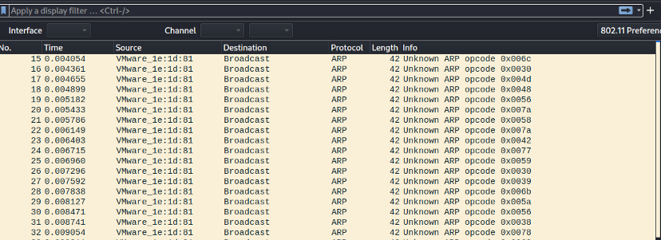
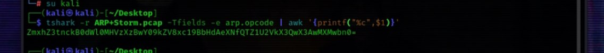
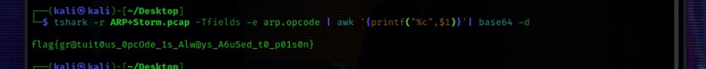

# cyber-talents -- ARP STORM challenge

## Challenge Description
## An attacker in the network is trying to poison the arp table of 11.0.0.100, the admin captured this PCAP.
## (https://hubchallenges.s3-eu-west-1.amazonaws.com/Forensics/ARP+Storm.pcap)
## After click in the link and download the pcap file 
## Load the packet in Wireshark and check the info section, you will find it contains some hex characters

## we will open terminal and use command
## tshark -r ARP+Storm.pcap -Tfileds -e arp.opcode | awk '{printf"%c",$1}'
## to remove unwanted text and show just base 64 text 

## then we use the same command but add | base 64 -d at the end to decrypt base 64 text to clear text 

## Answer : flag{gr@tuit0us_0pcOde_1s_Alw@ys_A6uSed_t0_p01s0n}
## Thanks for see my write up wait for more next time 
