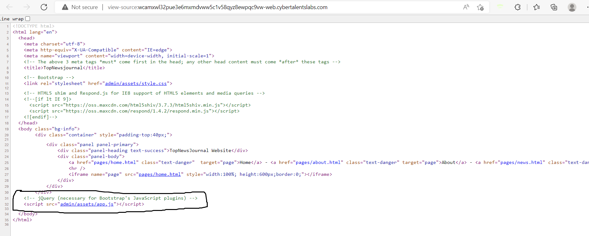
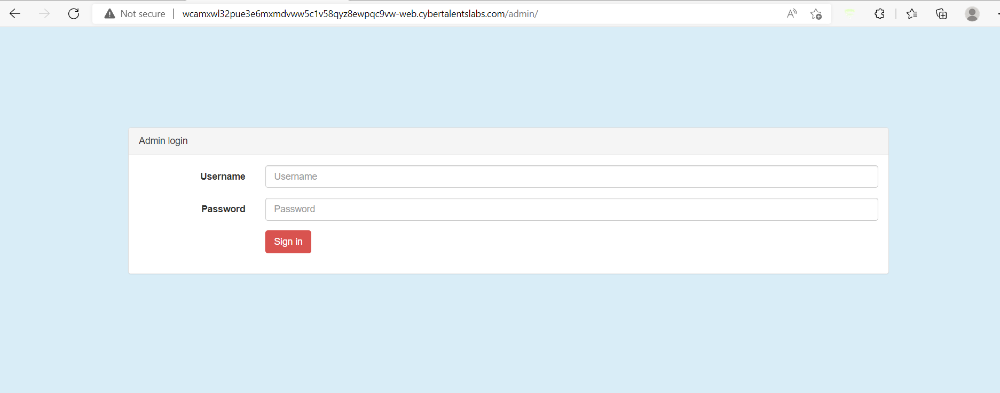
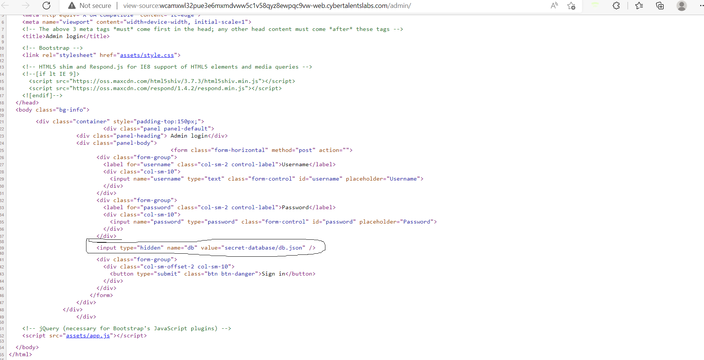
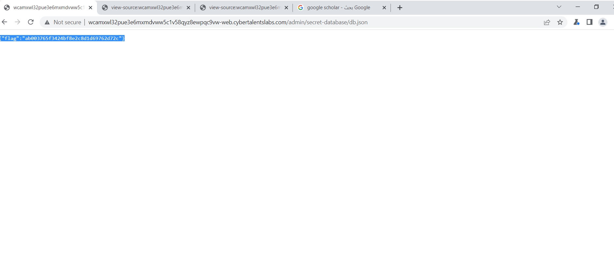
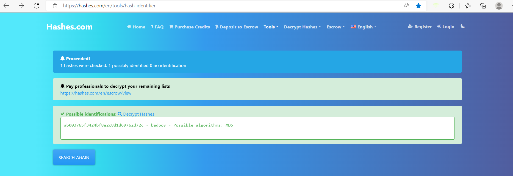

# Encrypted-Database challenge (web security)

## challenge description : 
## The company hired an inexperienced developer, but he told them he hided the database and have it encrypted so the website is totally secure, can you prove that he is wrong ??
## challenge link :
## (http://wcamxwl32pue3e6mxmdvww5c1v58qyz8ewpqc9vw-web.cybertalentslabs.com/)
## viewing the main page and go through diffrent pages we can't find any login pages or databases

## so we will view page source code by enter ctrl + u 
## we will find link called admin/assets/app.js in script tag

## we can try to append it to main page url but it lead to nothing 
## so we can try to add /admin/ at the end of main page url it lead to admin sign in page 

## we can check the page source of the admin login page 

## now we can see a hidden db with the value secret-database/db.json
## so we can try to add secret-database/db.json at the end of main page url  it lead to flag page 

## but flag is decrypted with hash we can know the possible hash and decrypt it with this website
## (https://hashes.com/en/tools/hash_identifier)

## hash type is md5 
## flag is badboy
## Thanks for watching my writeup and wait for more challenges
